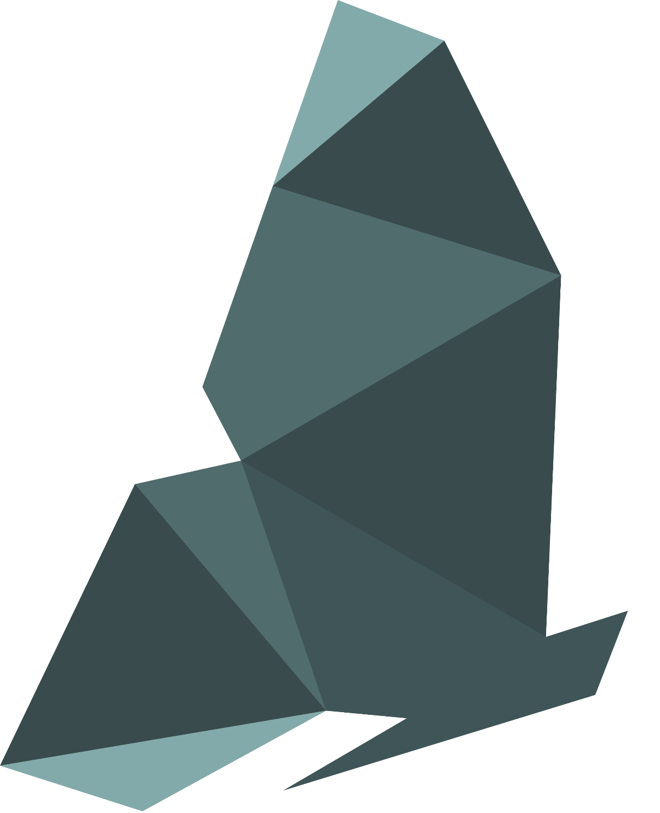

⚠️ this page is under construction, unofficial, and is likely incomplete ⚠️

<a href="https://cordis.europa.eu/project/id/101181930"></a>

[edit](https://github.com/globalbioticinteractions/globalbioticinteractions.github.io/edit/main/euroappa/index.md) / [contact via GitHub](https://github.com/globalbioticinteractions/globalbioticinteractions/issues/new?title=about%20EuroAPPA%20.%20.%20.%20&body=HI%21%0A%0AI%20noticed%20your%20page%20at%20https%3A%2F%2Fglobalbioticinteractions.org%2FEuroAPPA%20and%20I%27d%20like%20to%20...%0A%0AThanks%2C%0A%5Byour%20name%5D) / [contact via email](mailto:euroappa@globalbioticinteractions.org?subject=about%20EuroAPPA%20.%20.%20.%20&body=HI%21%0A%0AI%20noticed%20your%20page%20at%20https%3A%2F%2Fglobalbioticinteractions.org%2FEuroAPPA%20and%20I%27d%20like%20to%20...%0A%0AThanks%2C%0A%5Byour%20name%5D)

[Butterfly's](https://butterfly-europe.eu/) EuroAPPA aims to be a:

> [...] One-stop shop for animal pollinator ecology: BUTTERFLY’s European Atlas of Plant-Pollinator Associations (EuroAPPA) will provide user-friendly access for all stakeholders to the most complete taxonomically-harmonised well-curated database of plant-pollinator interactions ever produced for Europe and three Overseas Territories/Outermost Regions. [...]

and is a key result defined in the [BUTTERFLY](https://cordis.europa.eu/project/id/101181930) proposal. 

The [BUTTERFLY](https://cordis.europa.eu/project/id/101181930) project is about "Mainstreaming pollinator stewardship in view of cascading ecological, societal and economic impacts of pollinator decline" and relates to the EU Horizon call: [HORIZON-CL6-2024-BIODIV-01-3](https://ec.europa.eu/info/funding-tenders/opportunities/portal/screen/opportunities/topic-details/horizon-cl6-2024-biodiv-01-2) — `Biodiversity and ecosystem services (HORIZON-CL6-2024-BIODIV-01) / Dependence of society and the economy on pollinators`. 

This page contains references to EuroAPPA and related projects with a specific focus on species interactions (e.g., plant-pollinator) datasets.  

## Data Management
EuroAPPA is subject to the Butterfly Data Management Plan. Here, we keep track of the various drafts, released versions and snapshots of the Data Management Plan:

 | name | live url | snapshot |  
 | --- | --- | --- |
 | DMP Draft | [google docs](https://docs.google.com/document/d/1eRsXw-bSWmz9mI1v1HHKdJez11sbjTsBtWsknAdkDF0/edit?tab=t.0) | [html](dmp-draft) / [markdown](dmp-draft.md) / [pdf](dmp-draft.pdf) / [docx](dmp-draft.docx) |
 | DMP Draft Alternate | [google docs](https://docs.google.com/document/d/1eRsXw-bSWmz9mI1v1HHKdJez11sbjTsBtWsknAdkDF0/edit?tab=t.0) | [html](dmp-draft-alternate) / [markdown](dmp-draft-alternate.md) / [pdf](dmp-draft-alternate.pdf) / [docx](dmp-draft-alternate.docx) |
 | DMP Version 1 | [butterfly wordpress](https://butterfly-europe.eu/en/wp-content/uploads/2025/09/Butterfly_D9pnt1_DMP_final.pdf) | ~~html~~ / ~~markdown~~ / [pdf](dmp-v1.pdf) / ~~docx~~ |
 | DMP Current | [butterfly wordpress](https://butterfly-europe.eu/en/wp-content/uploads/2025/09/Butterfly_D9pnt1_DMP_final.pdf) | ~~html~~ / ~~markdown~~ / [pdf](dmp.pdf) / ~~docx~~ |


Associated meeting notes at ~~Google Docs (live copy)~~ with versioned copies at [dmp-notes.pdf](./dmp-notes.pdf) and [dmp-notes](./dmp-notes).

# Use Cases

A versioned snapshot of EuroAPPA associated use cases (under development!) are available at [use-cases](./use-cases). 

# Monthly Meeting

First Tuesdays at 07:00 US Central / 13:00 Sussex / 14:00 Central European Time.

[rolling meeting notes (google doc)](https://docs.google.com/document/d/1MDfcQESQh9abAxIhAs4gCRi88SnTP0s39bscvsREgto/edit), [notes.pdf (versioned snapshot)](./notes.pdf)


# Events

 **2024-02-22** - Deadline EU Horizon's [Biodiversity and ecosystem services (HORIZON-CL6-2024-BIODIV-01)](https://ec.europa.eu/info/funding-tenders/opportunities/portal/screen/opportunities/topic-details/horizon-cl6-2024-biodiv-01-2)  

 **2024-07-01** - EuroAPPA meeting to discuss ways to collaborate and organize within BUTTERFLY and across other initiatives. See  [meeting notes](https://docs.google.com/document/d/1MDfcQESQh9abAxIhAs4gCRi88SnTP0s39bscvsREgto/edit).
 
 **2025-03-01** - [BUTTERFLY](https://cordis.europa.eu/project/id/101181930) official start date see also [https://cordis.europa.eu/project/id/101181930](https://cordis.europa.eu/project/id/101181930) and [https://butterfly-europe.eu/](https://butterfly-europe.eu/) .

 **2025-04-03/2025-04-04** BUTTERFLY Project Kick-off. 3-4 April 2025, Norway House at CIUP, Paris, France. [Agenda](assets/Draft_BUTTERFLY_Project_KickoffAgenda_20250401.pdf)
 
 **2025-04-03** presentation "EuroAPPA: Mobilizing BUTTERFLY Pollinator Data Through Continuous Data Review" by Jorrit Poelen [google slides](https://docs.google.com/presentation/d/1PhiklCR0c-IkieZlvpCV95e1Z4BFr49h/edit?slide=id.g340130fcc5d_0_194#slide=id.g340130fcc5d_0_194)/ [pdf](assets/BUTTERFLY-GloBI-EuroAPPA-Poelen-2025-04-03.pdf) 

 **2025-04-07** [Project ‘Butterfly’ takes flight in Paris! by prof. Jeff Ollerton](https://jeffollerton.co.uk/2025/04/07/project-butterfly-takes-flight-in-paris/) . 

 **2025-08-31** Release of Butterfly's [Drivdal et al. (2025). D9.1 Data Management Plan – Version 1 –  (PDF, 859 KB)](https://butterfly-europe.eu/deliverable-9-1-data-management-plan-dmp-first-version/). See [dmp-v1.pdf](dmp-v1.pdf) for a versioned copy.

 **2026-01-28/30** BUTTERFLY Annual General Meeting (AGM) and General Assembly (GA), 28-30 January 2026, Aarhus, Denmark. [agenda (draft)](https://cloud.butterfly-europe.eu/index.php/s/NpbfmQ4433kY23E) . 

 **...**

# Partners 

EuroAPPA aims to work with the 24 BUTTERFLY partners to help (1) mobilizing existing data (2) access to newly collected data (3), to facilitate processing datasets into model output. 

## List of Partners 

[The Database of Pollinator Interactions (DoPI)](https://www.sussex.ac.uk/lifesci/ebe/dopi/about) see also [#780](https://github.com/globalbioticinteractions/globalbioticinteractions/issues/780) . 

[BeeLife.eu](https://bee-life.eu) 

## Affiliated projects

 [ProPollSoil](../propollsoil) "Understanding and managing soil health impacts to protect soil-dependent pollinators" aims to reuse EuroAPPA 
...

# Dataset Review

To help better understand existing datasets, EuroAPPA aims to review datasets. The list below contains the list of dataset selected for review.

Click on badges to browse/download indexed records or inspect automated reviews.

[edit dataset list](https://github.com/globalbioticinteractions/globalbioticinteractions.github.io/blob/main/_data/euroappa.tsv)





[]({{ globi-url }}) <a href="#{{ c.dataset }}">{{ c.dataset }}</a> {{ " / " }}


|status|<ins>M</ins>etadata\|<ins>D</ins>ata\|<ins>R</ins>eview|dataset|contact|
|---|---|---|---


 




{%- assign names-url = c.review_id | trim | uri_escape | prepend: "https://api.globalbioticinteractions.org/interaction.csv?type=csv&sourceTaxon=no%3Amatch&includeObservations=true&accordingTo=globi%3A" -%}





{%- assign zenodo-review-url = c.review_id | trim | urlencode | prepend: "https://zenodo.org/communities/globi-review/records?q=%22urn%3Alsid%3Aglobalbioticinteractions.org%3Adataset%3A" | append: "%22" -%}












[]({{ zenodo-review-url }}) []({{ review-url }}) []({{ globi-url }}) []({{ config-url }}) []({{ issues-url }}) | <span class="{{ c.metadata_access }}" title="At this time, metadata of dataset {{ c.dataset }} is {{ c.metadata_access }} access.">M</span> \| <span class="{{ c.data_access }}" title="At this time, data of dataset {{ c.dataset }} is {{ c.data_access }} access.">D</span> \| <span class="{{ c.review_report_access }}" title="At this time, the review report of dataset {{ c.dataset }} is {{ c.review_report_access }} access.">R</span> | <span id="{{ c.dataset }}">{{ c.dataset }}</span> | {{ c.contact }} | 


# Related Initiatives

[INC-STEP – Creating a National Reference Collection for Spain’s Threatened Pollinators](https://tettris.eu/2024/10/25/inc-step-creating-a-national-reference-collection-for-spains-threatened-pollinators/) funded through https://tettris.eu . https://tettris.eu/awarded-projects/ . 

[Running List of Related Initiatives](https://docs.google.com/document/d/1MDfcQESQh9abAxIhAs4gCRi88SnTP0s39bscvsREgto/edit?tab=t.bcaxfrmawmxl). For a versioned snapshot of this list, see [related-projects.pdf](related-projects.pdf).

[EU Pollinator Hub](https://pollinatorhub.eu). See also [#991](https://github.com/globalbioticinteractions/globalbioticinteractions/issues/991).

[SafeGuard](https://www.safeguard.biozentrum.uni-wuerzburg.de) / [SafeHub](https://www.safeguard.biozentrum.uni-wuerzburg.de/Project/SafeHub.aspx) (used by VALOR developed by Pensoft). See also [#989](https://github.com/globalbioticinteractions/globalbioticinteractions/issues/989) and [SafeGuard Database Download ](https://www.safeguard.biozentrum.uni-wuerzburg.de/Download/Download.aspx) and [EuPPollNet](https://github.com/globalbioticinteractions/globalbioticinteractions/issues/1041).
 
[VALOR](https://cordis.europa.eu/project/id/101181169) - see [synergy meeting notes](https://docs.google.com/document/d/1kMT17tVcH-hU1dBYdEbIoYHyELvNHpwPH9WoLwefqNI/edit?usp=sharing)

[Big Bee](https://big-bee.net) see also [GloBI's Big Bee Page](https://globalbioticinteractions.org/bigbee). 

[WorldFAIR WP10 on Agricultural Biodiversity](https://globalbioticinteractions.org/worldfair) - The WorldFAIR Case Study on Agricultural Biodiversity (WP10) addresses the challenges of advancing interoperability and mobilising plant-pollinator interactions data for reuse.  

[BatBase](https://batbase.org) - formerly called ```batplant.org``` this project indexes bat interactions including bat pollinations. BatBase is part of  [GBatNet's Eco-interactions Working Group](https://globalbioticinteractions.org/gbatnet). 

## Platforms of interest

 * [Big Data Analytics Platform](https://jeodpp.jrc.ec.europa.eu/bdap/) https://jeodpp.jrc.ec.europa.eu/bdap/ - The [JRC Big Data Analytics Platform (BDAP)](https://jeodpp.jrc.ec.europa.eu/bdap/) links data, data services, data scientists and thematic experts for generating policy relevant insights and foresight. It will play an instrumental role in advancing JRC to better mobilise and synthesise its collective knowledge and expertise in support to the EC priorities.  
 ** with hosted map being - European Commission, Joint Research Centre (JRC) (2022): EUCROPMAP 2022. European Commission, Joint Research Centre (JRC) [Dataset] doi: 10.2905/555e5d1d-1aae-4320-a716-2e6d18aa1e7c PID: http://data.europa.eu/89h/555e5d1d-1aae-4320-a716-2e6d18aa1e7c
