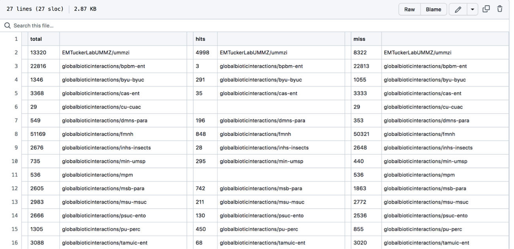
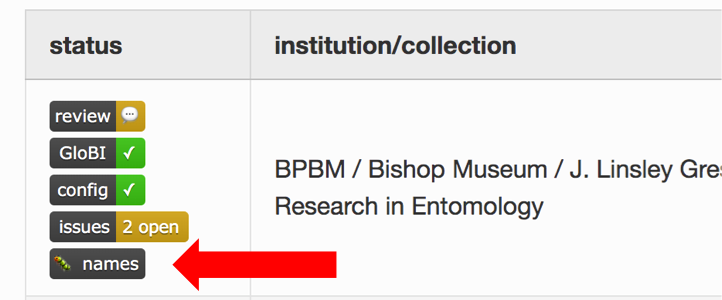
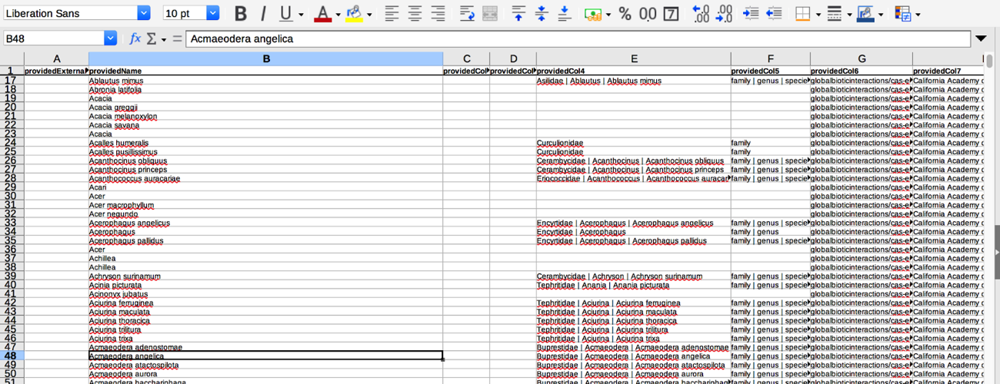
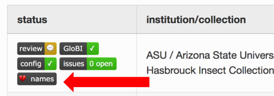

# **A 'How-To' Guide for Extracting GloBI Data** 😃 <span id="top"/>

GloBI has a ton of useful data in it and can be used in many different ways. However, it can also be a bit overwhelming with so much data. This page offers some helpful links, hacks, and instructions for how to extract the information available in a useful format. 

Do you have web programing skills? Extra time on your hands? Want to help make easy to push buttons, search boxes, or other web interface type improvements to GloBI? PLEASE contact [Jorrit](mailto:jhpoelen@jhpoelen.nl)! We'd love the extra help!

## **Contents**

* [Introduction to using GloBI](#intro) 
* [Pre-compiled Datasets](#datasets)
   * [Terrestrial Parasite Tracker (TPT) data](#TPT)
   * [SCAN data](#SCAN)
   * [Big-Bee data](#bigbee)
* [General Searches](#searches)
   * [Search from Home Page](#home-search)
   * [Search from Browse Page](#browse-search)
* [Using R](#R)
* [Using the Command Line](#command-line)
   * [General datasets](#command-line)
   * [Custom taxon list search](#batch-list)
* [GloBI Hacks](#hacks)
   * [No-download data viewing](#no-download) 
   * [Name matching with other databases](#nomer)
* [Name Alignment Tool](#names)
   * [TPT Group Name Matches](#names-TPT)
   * [Individual Collection/Dataset Name Matches](#names-individual)
   * [Customized Name List Comparisons](#names-custom)
   * [More name matching with Nomer](#nomer)
* [GloBI related projects!](#projects)
   * [Current projects](#current-projects) 
   * [GloBI Related Workshops](#workshops)
   * [Add a related project](#add-project)

<!-- ## ❗ ⚠️ Page under construction ⚠️ ❗ -->

---
<br>

## **Introduction to using GloBI** <span id="intro"/>

Did you know there is a video tutorial on how to use GloBI?\
[A Practical Exploration of Biotic Interaction Data Management and Information Retrieval through TPT and GloBI](https://vimeo.com/546669878) (video)

There are also detailed step-by-step instructions from the [Species Interaction Data Workshop](https://www.globalbioticinteractions.org/interaction-data-workshop/) on how to extract information from GloBI. 
1. [Getting Interaction Data](https://www.globalbioticinteractions.org/interaction-data-workshop/02-data/)
2. [Working with the Whole Dataset](https://www.globalbioticinteractions.org/interaction-data-workshop/03-ixodes-whole-dataset/index.html)
3. [Exploring Ixodes (tick) Records By Pointing and Clicking](https://www.globalbioticinteractions.org/interaction-data-workshop/04-ixodes-point-and-click/index.html)
4. [Data Sources: Interaction Data Record Review](https://www.globalbioticinteractions.org/interaction-data-workshop/07-reviewing-interaction-records/)
5. [Data Sources: Taxonomic Name Review](https://www.globalbioticinteractions.org/interaction-data-workshop/06-reviewing-taxonomic-names/index.html)

<br>

#### <sub> [Top of Page](#top) </sub>

---
<br>

## **Pre-compiled Datasets** <span id="datasets"/>

Did you know, GloBI has a number of datasets and files pre-compiled and ready to download?! 

Just go to the [GloBI Sources page](https://www.globalbioticinteractions.org/sources), find a collection or group's dataset you are interested in, and click the "review" button on the left with the green checkmark. Then copy the file you want and paste it into your web browser address box. It will automatically start to download the file 😃

Here are some multiple collection precompiled datasets you may find useful:

### **Terrestrial Parasite Tracker (TPT) data** <span id="TPT"/>
[Terrestrial Parasite Tracker](https://parasitetracker.org) is a NSF-funded project that aims to digitize natural history collection records related to parasites and their vertebrate hosts. 
- [List of all data files available](https://zenodo.org/record/5572874)
- [.tsv file of some interactions from TPT data](https://zenodo.org/record/5572874/files/indexed_interactions_simple.tsv.gz?download=1)
- [.tsv file of *ALL* interactions from TPT](https://zenodo.org/record/5572874/files/indexed_interactions_full.tsv.gz?download=1)\
      *Note: this is LARGE file so it will need to be unzipped/compressed. See below for ways to download un-zipped/compressed file...*
- [.tsv file of interactions for each collection in TPT](https://zenodo.org/record/5572874/files/indexed_interactions_by_collection.tsv?download=1)
- [List of collections in the TPT group on GloBI](https://www.globalbioticinteractions.org/parasitetracker/)

### **SCAN data** <span id="SCAN"/>
[Symbiota Collections of Arthropods Network (SCAN)](https://scan-bugs.org) ([https://scan-bugs.org](https://scan-bugs.org)) is "A Data Portal Built to Visualize, Manipulate, and Export Species Occurrences." 
- [List of all data files available](https://depot.globalbioticinteractions.org/reviews/globalbioticinteractions/scan/README.txt)
- [.csv file of some interactions from SCAN data](https://depot.globalbioticinteractions.org/reviews/globalbioticinteractions/scan/indexed-interactions-sample.csv)
- [.csv file of *ALL* interactions from SCAN](https://depot.globalbioticinteractions.org/reviews/globalbioticinteractions/scan/indexed-interactions.csv.gz)\
      *Note: this is LARGE file so it will need to be unzipped/compressed. See below for ways to download un-zipped/compressed file...*

### **Big-Bee data**  <span id="bigbee"/>
The [Big Bee project](https://big-bee.net/) ([https://big-bee.net/](https://big-bee.net/)) aims to "Extend Anthophila research through image and trait digitization." 
- [List of collections in the Big-Bee group](https://www.globalbioticinteractions.org/bigbee/)

Big-Bee publishes a quarterly report of global bee interactions indexed by GloBI that includes additional data curation such as the removal of duplicate records. This publication includes interactions from museum specimens, journal publications, and observations in both comma and tab-delimited formats.

Katja C. Seltmann. (2022). Global Bee Interaction Data (v1.0.1) [Data set]. Zenodo. [https://doi.org/10.5281/zenodo.6564738](https://doi.org/10.5281/zenodo.6564738) on May 19, 2022

<br>

#### <sub> [Top of Page](#top) </sub>

---
<br>

## **General Searches** <span id="searches"/>

### **Search from home page** <span id="home-search"/>
- Navigate to [GloBI's home page](https://www.globalbioticinteractions.org/)
- Enter an organism name in one or both search boxes
- Hit search


- You can browse these result in the resulting list, or for a downloadable list, click the “Open results in interaction browser” link
- This will bring up a map, two different interactive interaction graphs, and a list of interactions on the left.
 


- To download the list of the interactions, click the “csv sample" link at the top of the list for a partial list, or for a full dataset click "all data” " and select the file you want.
   - Copy and paste the file name into your browser address box to download, or use the [hack below](#no-download) to view the dataset without downloading

### **Search from browse page** <span id="browse-search"/>

To search from the [GloBI browse page](https://www.globalbioticinteractions.org/browse/):
- Clear the name "Chelonia mydas" in green by clicking the little "x" next to it (unless of course this is the organism you are interested in!)
- Type in the scientific name of the organism you want to look up and select it from the dropdown menu when it comes up (you need to actually select it from the list, not just type it in)
- Examine the preview list automatically produced
- Click "download csv data sample" or	"access full dataset" at the top of the list depending on the dataset you need 
- If your browser cuts off some of the search boxes strangely like mine does, click the little grey box within a box icon on the top left of the page (next to the qestion mark - it says "maximize/minimize" if you hover your mouse over it for a bit". This will hide the maps and make it easier to see the list and search boxes.

<br>

#### <sub> [Top of Page](#top) </sub>

---
<br>

## **Using R** <span id="R"/>

For those that are comfortable using R, install and use **rglobi** for more precise and filtered datasets. 
- [rglobi CRAN (download) page](https://cran.r-project.org/web/packages/rglobi/index.html)
- [rglobi GitHub installation instructions](https://github.com/ropensci/rglobi)
- [Detailed instructions on how to use rglobi](https://github.com/ParasiteTracker/TPT-GloBI-R-Demo/blob/master/globi-to-graph2019.R)
- [How to use GloBI data in bipartite interaction analyses](https://www.globalbioticinteractions.org/deadwood2021/13-day-two-part-two/)

<br>

#### <sub> [Top of Page](#top) </sub>

---
<br>

## **Using the Command Line** <span id="command-line"/>
### **General datasets** <span id="command-line"/>

If you are are comfortable with using command line scripts and codes (i.e., in terminal, shell, etc.) you may find the following "[Big Data Cheatsheet](https://www.globalbioticinteractions.org/deadwood2021/code/cheatsheet.txt)" useful. 

After you download the dataset you need (see [Pre-compiled Datasets](#datasets), [General Searches](#searches), or the [GloBI data page](https://www.globalbioticinteractions.org/data)), you can  modify the following code to fit your dataset needs:

```
$ time cat data/stable/interactions.csv.gz\
  | gunzip\
  | mlr --csv filter '$sourceTaxonKingdomName == "Fungi"'\
  | mlr --csv filter '$targetTaxonGenusName == "Quercus"'\
  | mlr --csv cut -f sourceTaxonName,targetTaxonName\
  > data/oakfungi.csv
$ time cat data/stable/interactions.csv.gz\
  | gunzip\
  | mlr --csv filter '$targetTaxonKingdomName == "Fungi"'\
  | mlr --csv filter '$sourceTaxonGenusName == "Quercus"'\
  | mlr --csv cut -f targetTaxonName,sourceTaxonName\
  | tail -n+2\
  >> data/oakfungi.csv

```

You can also load a dataset from GloBI into a sqlite3 database on your personal computer by using/modifying the following code (after downloading the dataset):

```
$ cat interactions.csv.gz\
| gunzip\
| sqlite3 -csv globi.db '.import /dev/stdin interactions'
```
Or for SCAN specific data:
```
$ cat interactions.csv.gz\
| gunzip\
| grep "globalbioticinteractions/scan" > globi-scan.csv
```
or:
```
cat interactions.csv.gz\
| gunzip\
| grep "globalbioticinteractions/scan"\
| wc -l
```

To reduce the size of sqlite3 (or other) database, you can drop columns before importing them using powertools like [cut](https://en.wikipedia.org/wiki/Cut_(Unix)) or [mlr/miller](https://github.com/johnkerl/miller). See the [importing csv files to sqlite page ](https://sqlite.org/cli.html#importing_csv_files).

If you can provide further step by step instructions on how to use these scripts, please add it to the [working guide](https://docs.google.com/document/d/1GjVMmGSBWJ8481BbkLfZC526eFG7TphupTf_ly98dtg/edit) and I will add to this page. I'm not a command line person, so any help adding to this section would be much appreciated!

<br>

### **Custom Taxon List Search** <span id="batch-list"/>

Want association information for multiple taxa without searching each name individually? Want to be able to download a csv with this data? Well, now you can!

1. Create a simple text (.txt) file with the names you want to find associations for. 
   - File should have a single column of names
   - For species names that have spaces in them, replace all spaces with “%20”. You can do this with a find and replace all procedure. Example: 
``` Cremnops montrealensis ``` ⇒ ``` Cremnops%20montrealensis ```
   - Save file with extension ``` .txt ```
2. Open a command line terminal on your computer (on Macs there is a built in one called “Terminal”)
3. Navigate to the folder you want the resulting files to be saved to. Example for macs:
```
Cd YourDocuments/YourFolderName/ProjectsFolder
```
4. Once in the folder you want your results to save to, run the following code in terminal:
   - This will produce and save a csv file with all associations in GloBI for the taxa in the list you made as well as the records the associations came from. 
```
cat YourNameList.txt\
| sed 's+^+https://api.globalbioticinteractions.org/interaction.csv?includeObservations=true\&sourceTaxon=+g'\
| xargs -L1 curl\
> results-YourNameList.csv
```
   Where:
   
   ``` sed 's+^+https://api.globalbioticinteractions.org/interaction.csv?includeObservations=true&sourceTaxon=+g' ```

   - Turns each name into a url request for individual records that involve the specified taxon.
   
   ``` xargs -L1 curl ```

   - Executes one request at a time using "curl" (command-line web browser)
   
   ```  > results-...csv ``` 

   - Saves the results in a file called "result[something].csv"

5. If you only want the taxon level information (not information about the individual records the associations came from) you can modify the code by omitting the ``` includeObservations=true ```. For example:
```
cat YourTaxaList.txt\
| sed 's+^+https://api.globalbioticinteractions.org/interaction.csv?sourceTaxon=+g'\
| xargs -L1 curl\
> results-YourInteractions.csv
```

Things to note about this procedure: 
- It may not work well for lists longer than 100 names
- These results are unstable (change everytime GloBI data changes) and are not in an easily citable format for research purposes..
For a test dataset and to practice with and to read the conversation as this procedure was figured out, check out [GitHub issue #782](https://github.com/globalbioticinteractions/globalbioticinteractions/issues/782)


#### <sub> [Top of Page](#top) </sub>

---
<br>

## **GloBI Hacks** <span id="hacks"/>

### **No-download data viewing** <span id="no-download"/>

You can view datasets from GloBI (or any other .csv/.tsv files online) without actually downloading them! This is possible by using Google Sheets and removing the 
".gz" extention of a file from the [GloBI Sources page](https://www.globalbioticinteractions.org/sources). 
- Open a new blank Google Spreadsheet in one browser tab/window
- In another browser tab/window, pick the dataset you want to view
   - On the [GloBI Sources page](https://www.globalbioticinteractions.org/sources), pick a collection or group
   - On the left of the items listed, click the "review" button with a green checkmark next to it
   - From the list of files that opens on a new page, copy the file name of the file you want to view (excluding the .gz part if it has it)
- Go back to your blank Google Spreadsheet tab
- In the first cell type the formula:

```
=IMPORTDATA("YOUR FILE NAME")
```
   Example: 
```
=IMPORTDATA("https://depot.globalbioticinteractions.org/reviews/globalbioticinteractions/scan/indexed-interactions-sample.tsv")
```
- Don't forget the quotation marks in the formula!

#### <sub> [Top of Page](#top) </sub>


---
<br>

## **Name Alignment Tool** <span id="names"/>
The Name Alignment Tool allows us to compare a list of names we may want to review (e.g., the association names we’ve shared with GloBI; list of names in a collection’s database) with a different or “accepted” or preexisting list of taxonomic names (e.g., ITIS; GBIF; Catalog of Life; TPT’s taxonomy; etc.). There are several different ways we can use the Alignment Tool and Jorrit has automated much of the process for us so we can just click a button to download or view different name alignments file(s) for comparison. Of course there are also a number of ways to customize the name comparisons relatively easily with GitHub and some simple command line prompts if you are so inclined 🙂

Here are some different ways to use the Alignment Tool: 

### **TPT Group Name Matches** <span id="names-TPT"/>
To review all the name matches in one place for collections involved in the TPT project, follow these instructions (super easy!): 
* → Go to the [Aligning TPT Collection Names with TPT Taxonomy](https://github.com/jhpoelen/align-tpt-names-with-tpt-taxonomy) page. 
* → Click [names.tsv](https://github.com/jhpoelen/align-tpt-names-with-tpt-taxonomy/blob/main/names.tsv) link to view a raw name alignment comparison file or the [names-parsed.tsv](https://github.com/jhpoelen/align-tpt-names-with-tpt-taxonomy/blob/main/names-parsed.tsv) link for a scrubbed and parsed version of the name alignment comparison file.
  * You can download this file by right clicking the link and selecting “save this file as”.
  * The file will look something like this:

  * The first column, _total_, is the total number of names associated with a collection’s dataset. 
  * The next unlabeled column is the collection or dataset associated with a set of names (each row is a different collection or dataset with names).
  * The column, _hits_, shows how many of the names in the dataset aligned/matched with the comparison name catalog (in this case the default is set to compare against names in ITIS). 
  * The _miss_ column shows how many names did not align with or match names in the comparison name file (again, the default is set to match with names in ITIS).
    * It should be noted that names may miss or not align with the comparison catalog for a number of different reasons…
    * ⇒ This is a really good way to double check the dataset you have linked to GloBI. Most names should be able to be aligned with the ITIS catalog. **If less than 50% of your names are a “_hit_” you should consider checking the data** you have uploaded/linked/shared! See the: [Pre-Compiled Datasets](#datasets)) section for instructions on how to pull up the data your collection has shared with GloBI. ⇐
  * To review the specific details of name alignments that “_hit_” or “_miss_” for a particular collection or dataset, see the next option…

### **Individual Collection/Dataset Name Matches** <span id="names-individual"/>
To review YOUR specific collection or dataset name matches, follow these instructions (super easy!):

<ins>**_TPT Collections_**</ins>
<br>For Collections in the TPT project:
* → Go to [GloBI’s Parasite Tracker page](https://www.globalbioticinteractions.org/parasitetracker/).
* → Find the collection with the names that you want to examine.
* → Click the “names” button next to the collection you are interested in:

  * This will prompt you to download a .csv file.
  * Save the file somewhere you can find it.
  * The file will look like this:

* There are a lot of informative columns in this dataset, however, here a few of the key ones you will want to be aware of:
  * **_providedName_** this is the name that was given in the downloaded collection’s dataset. 
  * **_relationName_** this tells you if the name from the downloaded collection’s dataset matches the taxon names in the alignment/comparison catalog (in this case we are comparing names with those in ITIS).
    * **_NONE_** means the dataset name didn’t align with any names in the catalog
    * **_HAS_ACCEPTED_NAME_** means the dataset name matched an accepted name in the catalog
    * **_SYNONYM_OF_** means the dataset name matched a synonymized name in the catalog
   * _**resolvedExternalId**_ is the taxon ID number in the comparison catalog if a dataset name matches an accepted or synonymized name.
   * **_resolvedName_** is the name in the catalog that aligned/matched with the providedName.
  * Currently the names for each collection’s dataset are aligned and compared to the taxonomic name list from ITIS by default. If you want the names compared to a different list (like GBIF or TPT names), see the next section, [Customized Name List Comparisons](#names-custom), to customize list alignment comparisons…. 

<ins> **_Big-Bee Collections_** </ins>
<br>For Collections in the Big-Bee project:
* → Go to [GloBI’s Big-Bee page](https://www.globalbioticinteractions.org/bigbee/).
* → Find the collection with the names that you want to examine.
* → Click the “names” button next to the collection you are interested in:

  * This will prompt you to download a .csv file.
  * Save the file somewhere you can find it.
* Follow remaining steps as in the above _TPT Collections_ instructions. 
  
<ins> **_All Collections & Datasets_** </ins>
<br>For all other collections and datasets this button is still being developed. Find your collection or dataset and see what options are availble by going to the [GloBI datasets page](https://www.globalbioticinteractions.org/datasets).

### **Customized Name List Comparisons** <span id="names-custom"/>
The Name Alignment Tool is set up so that it can be customized to align and compare any list of taxon names (must be appropriately formatted) to a number of different name catalogs including but not limited to: ITIS, NCBI, discoverlife, GBIF, COL, Open Tree of Life, GloBI taxon graph. There is a whole **[detailed workshop tutorial](https://big-bee-network.github.io/name-alignment-workshop/)** on how to customize name list alignments for comparison provided by the Big-Bee TCN (thanks Big-Bee!). The workshop has step-by-step instructions with lots of screenshots on how to customize the both lists of names to compare. 

A GitHub account (free!) and a minimal amount of copying, pasting, and uploading files to GitHub will be necessary for these customizations, but everything is explained in great detail on the [workshop website](https://big-bee-network.github.io/name-alignment-workshop/) so that anyone can successfully customize their list comparisons - even with no previous experience using GitHub, coding, or a terminal.
* → Go to the [Name Alignment Workshop website](https://big-bee-network.github.io/name-alignment-workshop/) (this is a self-guided, go at your own pace workshop/tutorial).
* → Follow the instructions given on the workshop website.
* → Email Jorrit if you run into any trouble! 

### **More name matching with Nomer** <span id="nomer"/>
Want more name alignment options? Check out the tool [Nomer](https://github.com/globalbioticinteractions/nomer)...


<br>

#### <sub> [Top of Page](#top) </sub>

---
<br>

## **GloBI Related Projects!** <span id="projects"/>
GloBI and the GloBI How-to page can be used in so many interesting projects and applications!

### **Current Projects** <span id="current-projects"/>
Here are just some of the projects that have used GloBI or the GloBI How-to page in their project:
* [Measuring the interactions of species with GloBI](http://datacuriosity.org/part1_globi_access/)
* [Learn to ask about species interactions effectively using automation and network graph visualization](http://datacuriosity.org/part2_globi_exploration/)
* [Getting started with GloBI to create networks](https://github.com/jrhillae/AlienCSI_VM_JH/blob/main/blogpost.md)

### **GloBI Related Workshops** <span id="workshops"/>
* [TPT-GloBI Species Interaction Data Workshop](https://www.globalbioticinteractions.org/interaction-data-workshop/)
* [Big-Bee Name Alignment Workshop](https://big-bee-network.github.io/name-alignment-workshop/)
* [ECM Interaction Data Interpretation Workshop](https://www.globalbioticinteractions.org/ecm-workshop/)
* [Dead Wood Interaction Data Workshop](https://www.globalbioticinteractions.org/deadwood2021/)

### **Add Your Project** <span id="add-project"/>
Do you have a project that used GloBI, is related to GloBI, or used the GloBI How-to page (this page)? Let us know! We love learning about new projects or related works and would like to list you project here! 
Just fill email [Jorrit](mailto:jhpoelen@jhpoelen.nl) or [Erika](mailto:emtuckerlab@gmail.com), fill out the out the [form below](https://forms.gle/qRiuD7hJno86peiU7), or [submit an issue](https://github.com/globalbioticinteractions/globalbioticinteractions.github.io/issues) and we'll add you to this page. So many ways to share and be included 😃

<iframe src="https://docs.google.com/forms/d/e/1FAIpQLSeFfHmoYhm1-ZWEuV6Gzs8DmX5S-SxSQYDLEpUIrf3fWJ1T_A/viewform?embedded=true" width="640" height="915" frameborder="0" marginheight="0" marginwidth="0">Loading…</iframe>


<br>

#### <sub> [Top of Page](#top) </sub>

---
<br>

Hopefully, this page had some helpful content to help you navigate GloBI!!

💡 **Have something helpful to add to this page?**

  ➡️ Please add it to the [working guide](https://docs.google.com/document/d/1GjVMmGSBWJ8481BbkLfZC526eFG7TphupTf_ly98dtg/edit) we are creating to help pull data out of GloBI. 

💡 **Have a problem or something we need to add?**

  ➡️ Please submit a request on the [issue page](https://github.com/globalbioticinteractions/globalbioticinteractions.github.io/issues)!

<br>

## 🚧 🚧 🚧 🚧 🚧 🚧 🚧 🚧 🚧 🚧 🚧 🚧 🚧 🚧 🚧 🚧 🚧 🚧 🚧 🚧 🚧 🚧 🚧 🚧

Need additional help the [working guide](https://docs.google.com/document/d/1GjVMmGSBWJ8481BbkLfZC526eFG7TphupTf_ly98dtg/edit) or [issue page](https://github.com/globalbioticinteractions/globalbioticinteractions.github.io/issues) doesn't cover? Contact page editor [Erika Tucker](mailto:emtuckerlab@gmail.com)

This page is supported in part by the [Terrestrial Parasite Tracker](https://parasitetracker.org/) group's efforts to produce sustainable, open access, digitization methods and related research tools ([NSF award# 1901932](https://www.nsf.gov/awardsearch/showAward?AWD_ID=1901932&HistoricalAwards=false)). 
