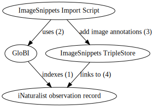
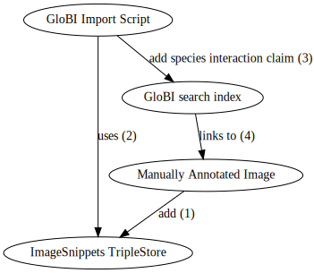

Image snippets provide semantic annotations and tools to query images. https://imagesnippets.com .

Global Biotic Interactions integrates with Image Snippets to exchange species interactions related to images. 


[edit this page](https://github.com/globalbioticinteractions/globalbioticinteractions.github.io/blob/main/imagesnippets/index.md) 

[events](#events)
/ [integration profiles](#integration-profiles) 
/ [translation tables](#translation-tables) 
/ [supported biotic interaction terms](#supported-terms) 


# Events 

**6 Aug 2021** - Exploratory meeting with Jorrit and Margaret - discussing example [https://imgsnp.co/xlvuw](https://imgsnp.co/xlvuw) and ways to easily re-use species interactions with photographic evidence.

# Integration Profiles

Integration profiles are descriptions on how data flows from one system to the next. 


## ImageSnippets

ImageSnippets is able to import existing annotation and related images. Global Biotic Interactions indexes datasets describing species interactions. Some of these datasets, like those provided via https://inaturalist.org, provide links to supporting photographic evidence.

This integration profile describes a way how ImageSnippets can re-use the GloBI indexed data to import image annotations related to a specific image. 

## ImagesSnippets re-using GloBI

 ImageSnippets re-using GloBI | GloBI Integration Profile 
 --- | --- 
 authors | Margaret Warren (ImageSnippets), Jorrit Poelen (GloBI)
 actors | ImageSnippets, GloBI data products
 integration method | A iNaturalist image describing a species interactions is indexed by GloBI (1). Periodically, an ImageSnippets workflow uses GloBI data product (2) (TODO Margaret et al. to determine which one from available products [https://globalbioticinteractions.org/data](GloBI data products) or more data review products via e.g., [https://depot.globalbioticinteractions.org/reviews/globalbioticinteractions/inaturalist/README.txt](https://depot.globalbioticinteractions.org/reviews/globalbioticinteractions/inaturalist/README.txt) ). After importing the data from GloBI (3), the ImageSnippets SPARQL endpoint allows for discovery of images contains species interactions via linked wikidata pages (4) (e.g., [WD:Q199458](https://www.wikidata.org/wiki/Q199458) and [WD:Q320193](https://www.wikidata.org/wiki/Q320193)). 
  diagram | 
example records | found via [Green Sea Turtle (Chelonia mydas) Interactions](https://www.globalbioticinteractions.org/?accordingTo=globi%3Aglobalbioticinteractions%2Finaturalist&interactionType=interactsWith&sourceTaxon=Chelonia%20mydas) https://www.inaturalist.org/observations/6549764 

## ImageSnippets as data source

 ImageSnippets as data source | GloBI Integration Profile 
 --- | --- 
 authors | Margaret Warren (ImageSnippets), Jorrit Poelen (GloBI)
 actors | ImageSnippets, GloBI data products
 integration method | An annotated image is added to ImageSnippets triplestore (1) Periodically, a GloBI queries/retrieves all ImageSnippets annotations that describe images depicting a species interaction (2). (TODO Margaret et al. to provide examples of how GloBI can best import ImageSnippet annotations e.g., SPARQL queries or data dumps). After importing retrieving data from ImageSnippets, GloBI includes references (3) to ImageSnippet links as supporting evidence for described claims (e.g., a reference to https://imgsnp.co/xlvuw appears with a citation string supporting the claim Green Sea turtle (_Chelonia mydas_) interacts with ([OBO:RO_0002437](http://purl.obolibrary.org/obo/RO_0002437)) Brown Booby (_Sula leucogaster_)the ImageSnippets SPARQL endpoint allows for discovery of images contains species interactions via linked wikidata pages (e.g., [WD:Q199458](https://www.wikidata.org/wiki/Q199458) and [WD:Q320193](https://www.wikidata.org/wiki/Q320193)). 
  diagram | 
example records | found via [Green Sea Turtle (Chelonia mydas) Interactions](https://www.globalbioticinteractions.org/?accordingTo=globi%3Aglobalbioticinteractions%2Finaturalist&interactionType=interactsWith&sourceTaxon=Chelonia%20mydas) https://www.inaturalist.org/observations/6549764 


# Interaction Types 
# Supported Terms
# Translation Tables

GloBI uses a subset of biotic interaction (or association) terms defined in the [OBO Relations Ontology](http://www.obofoundry.org/ontology/ro.html) (OBO RO) to help classify and index biotic associations in collection records. Verbatim association types (e.g., ```on```, ```parasite of```, ```found on```) are explicitly mapped into these OBO RO terms using translation tables. GloBI keeps a default translation tables and specific collection may choose to provide their own (see e.g., [INHS-Insects](https://github.com/globalbioticinteractions/inhs-insects) ).

| resource | description |
| --- | --- |
| [OBO Relations Ontology project page](http://obofoundry.org/ontology/ro.html) | OBO RO contains many kinds of terms, not just biotic associations terms |
| [List of OBO RO Biotic Interaction Terms with definitions](https://github.com/globalbioticinteractions/nomer/blob/main/nomer/src/test/resources/org/globalbioticinteractions/nomer/match/ro.tsv) | a table of RO biotic interaction terms and their definitions (if available)
| [List of GloBI Supported Interaction Terms](https://github.com/globalbioticinteractions/globalbioticinteractions/blob/main/eol-globi-lib/src/main/resources/org/globalbioticinteractions/interaction_types_ro.csv) | subset of RO interactions terms that GloBI uses for indexing |
| [Default Verbatim Terms Translation Table](https://github.com/globalbioticinteractions/globalbioticinteractions/blob/main/eol-globi-lib/src/main/resources/org/globalbioticinteractions/interaction_types_mapping.csv) | the translation table used by GloBI to maps verbatim interaction terms to supported interaction terms
| [Example of Custom Verbatim Terms Translation Table](https://github.com/globalbioticinteractions/inhs-insects/blob/main/interaction_types_mapping.csv) | if provided/needed, GloBI can use a custom mapping provided by a collection |

The OBO RO is far from complete and we expect to add new terms and improve definitions as needed. Also, GloBI translation tables can be easily updated when needed. Please [open an issue](https://github.com/globalbioticinteractions/globalbioticinteractions/issues/new) if you have questions or suggestions. 
