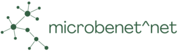

⚠️ this page is under construction, unofficial, and is likely incomplete ⚠️

[edit](https://github.com/globalbioticinteractions/globalbioticinteractions.github.io/edit/main/microbenetnet/index.md) / [contact via GitHub](https://github.com/globalbioticinteractions/globalbioticinteractions/issues/new?title=about%20MicrobeNetNet%20.%20.%20.%20&body=HI%21%0A%0AI%20noticed%20your%20page%20at%20https%3A%2F%2Fglobalbioticinteractions.org%2FMicrobeNet^Net%20and%20I%27d%20like%20to%20...%0A%0AThanks%2C%0A%5Byour%20name%5D) / [contact via email](mailto:microbenetnet@globalbioticinteractions.org?subject=about%20MicrobeNetNet%20.%20.%20.%20&body=HI%21%0A%0AI%20noticed%20your%20page%20at%20https%3A%2F%2Fglobalbioticinteractions.org%2Fmicrobenetnet%20and%20I%27d%20like%20to%20...%0A%0AThanks%2C%0A%5Byour%20name%5D)

MICROBENet-Net: Multi-Institute Collaborative Research on BElowground plant-microbial interactions Network of Networks. 2024/2028 [NSF AccelNet Award 2412561](https://www.nsf.gov/awardsearch/showAward?AWD_ID=2412561) [https://microbenetwork.net/](https://microbenetwork.net/).

MicrobeNet^Net 

> [...] MICROBENet^Net Theme and Grand Challenge: Plants and microorganisms regulate a diverse array of processes that modulate the Earth system. Yet, we know remarkably little about how variable plant-microbial interactions are across the globe, how microbial connections with plants respond to global change, and if changes in plant-microbe interactions will lead to predictable changes in plant, ecosystem, and macro-scale ecology. While microbial ecologists and plant ecologists both explore questions about geography, interactions, and function, this work has often occurred in plant or microbial silos. Focusing on either plants or microbes resulted in the development of distinct disciplinary vocabularies and meanings, even when using similar tools and asking questions across similar scales. [...]

# Events

 **2025-03-20/2025-03-24** - MicrobeNet^Net colloquium hosted by the University of Tennessee Knoxville. 

 **2025-03-21** - A prototype to show overlap of taxonomic plant names of possible fungal hosts across various plant-fungus datasets. See [Shared Plant Taxa across MicrobeNetNet Databases (prototype)](https://github.com/jhpoelen/fungal-plant-host-overlap?tab=readme-ov-file#microbenetnet-prototype---common-plant-taxa-across-databases).

 **2025-05-29** - Holly Andres documents 2025 MicrobeNet^Net Colloquium by publishing: Sikes, B., Classen, A., Kivlin, S., Zanne, A., & Holly Andres. (2025). 2025 MicrobeNet^Net Colloquium. 2025 MicrobeNet^Net Colloquium, Knoxville, TN. Zenodo. [https://doi.org/10.5281/zenodo.15547951](https://doi.org/10.5281/zenodo.15547951)

 **2025-05-30** - Daniel Mietchen publishes "2025 MicrobeNet^Net Colloquium" [https://scholia.toolforge.org/event/Q134609359](https://scholia.toolforge.org/event/Q134609359) and [https://www.wikidata.org/wiki/Q134609359](https://www.wikidata.org/wiki/Q134609359) including references to colloquium participants based on Sikes et al. 2025. [doi:10.5281/zenodo.15547951](https://doi.org/10.5281/zenodo.15547951).

 **2025-06-11** - Follow-up meeting exploring research questions related AMF (Arbuscular Mycorrhizal Fungi) and fine root traits of their host plants using FRED and MaarjAM data. Rolling meeting notes at: [https://docs.google.com/document/d/1NIx1X24DW-z5e-MzNbNOccld1OTqO-ojYfwnDfw6lQA/edit?tab=t.0#heading=h.w7heqg8icqx8](https://docs.google.com/document/d/1NIx1X24DW-z5e-MzNbNOccld1OTqO-ojYfwnDfw6lQA/edit?tab=t.0#heading=h.w7heqg8icqx8) . 

 **2026-02-26** - Published an experimental MicrobeNetNet data review corpus following the MicrobeNetNet General Meeting showing how heterogeneous datasets can be versioned and integrated as a unified data corpus for review and data exploration. The initial focus in on dataset describing species interactions. Poelen, J. H. (2026). MicrobeNetNet Dataset Review Corpus and Associated Data Products hash://md5/5981a37a16c25204dc18d9188f185b19 hash://sha256/7448991edd5f79db02519a5b3d4691c50a60c02f45d40f087402a7a492da3a3e [Data set]. Zenodo. [https://doi.org/10.5281/zenodo.18794828](https://doi.org/10.5281/zenodo.18794828).

 **2026-02-26** - Ben Sikes created [MicrobeNetNet #tracking-databases](https://app.slack.com/client/T068C6GQ1MW/C0AH89QFH9T) channel to facilitate the sharing 

# Dataset Review

To help better understand existing fungal-plant interaction datasets, MicroNet^Net aims to better connect and use these existing datasets. The list below contains the list of dataset selected for review.

Click on badges to browse/download indexed records or inspect automated reviews.

[edit dataset list](https://github.com/globalbioticinteractions/globalbioticinteractions.github.io/blob/main/_data/microbenetnet.tsv)





 <a href="#{{ c.dataset }}">{{ c.dataset }}</a> {{ " / " }}


|status|<ins>M</ins>etadata\|<ins>D</ins>ata\|<ins>R</ins>eview|dataset|contact|
|---|---|---|---|


 




{%- assign names-url = c.review_id | trim | uri_escape | prepend: "https://api.globalbioticinteractions.org/interaction.csv?type=csv&sourceTaxon=no%3Amatch&includeObservations=true&accordingTo=globi%3A" -%}





{%- assign zenodo-review-url = c.review_id | trim | urlencode | prepend: "https://zenodo.org/communities/globi-review/records?q=%22urn%3Alsid%3Aglobalbioticinteractions.org%3Adataset%3A" | append: "%22" -%}














     | M \| D \| R | {{ c.dataset }} | {{ c.contact }} | 


# Related

Species interactions in tree-fungus systems - [https://mariashumskaya.com/connect-at-the-2026-meeting-on-tree-fungus-species-interactions/](https://mariashumskaya.com/connect-at-the-2026-meeting-on-tree-fungus-species-interactions/) - A four‑day meeting centered on wood ecology, with a particular focus on species interactions within tree–fungus systems. This mini‑symposium brings together leading experts to synthesize the current state of the field, highlight emerging research frontiers, and establish new opportunities for networking and collaboration.  

Dead Wood Course 2026 led by Dmitry Schigel [https://adlignum.com/dead-wood-course-2026-forma-iberica](https://adlignum.com/dead-wood-course-2026-forma-iberica)

Romero-Olivares, A.L., Morrison, E.W., Pringle, A. et al. Correction to: Linking Genes to Traits in Fungi. Microb Ecol 82, 156 (2021). https://doi.org/10.1007/s00248-021-01776-x

van Galen, L.G., Smith, G.R., Margenot, A.J. et al. A global database of soil microbial phospholipid fatty acids and enzyme activities. Sci Data 12, 1568 (2025). https://doi.org/10.1038/s41597-025-05759-2

Szánthó, L.L., Merényi, Z., Donoghue, P. et al. A timetree of Fungi dated with fossils and horizontal gene transfers. Nat Ecol Evol 9, 1989–2001 (2025). https://doi.org/10.1038/s41559-025-02851-z

Goicolea, T., Morales-Barbero, J., García-Viñas, J.I. et al. A unified plant ecology database for Spain. Sci Data (2026). https://doi.org/10.1038/s41597-026-06757-8

Díaz, S., Kattge, J., Cornelissen, J.H.C. et al. The global spectrum of plant form and function: enhanced species-level trait dataset. Sci Data 9, 755 (2022). https://doi.org/10.1038/s41597-022-01774-9

