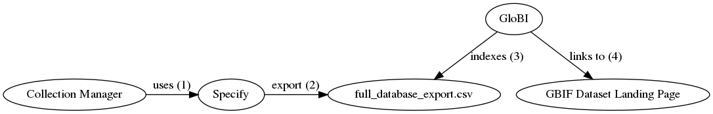

This [Terrestrial Parasite Tracker](https://parasitetracker.org) (TPT) status page shows the current state of integration between TPT affiliated collections and GloBI.

[edit this page](https://github.com/globalbioticinteractions/globalbioticinteractions.github.io/blob/master/parasitetracker/index.md) / [edit collection list](https://github.com/globalbioticinteractions/globalbioticinteractions.github.io/blob/master/_data/parasitetracker.tsv) / [ask a question](https://github.com/ParasiteTracker/data-issues-observations-and-questions/issues) / [contribute data](https://github.com/globalbioticinteractions/globalbioticinteractions/issues) / [integration profiles](#integration-profiles) / [DwCA Guidelines](#dwca-guidelines) 

Click on badges to explore indexed records.

[edit collection list](https://github.com/globalbioticinteractions/globalbioticinteractions.github.io/blob/master/_data/parasitetracker.tsv)





 <a href="#{{ c.institution_code }}">{{ c.institution_code }}</a> {{ " / " }}


1 Oct 2019 Parasite Tracker kick-off [presentation](./assets/globi_adbc_summit_20191001.pdf) / [video](https://vimeo.com/362883545). 

|indexed|institution|collection|platform|platform detail|contact|
|---|---|---|---|---


 
 
 | {{ c.institution_code }} / {{ c.institution }} | {{ c.collection_code }} / {{ c.collection }} | [{{ c.platform }}](#{{ c.platform | downcase }}) | {{ c.platform_detail }} | {{ c.contact }} | 


# Integration Profiles
Integration profiles are descriptions on how data flows from one system to the next. Because the Parasite Tracker community is using a variety of tools (e.g., Arctos, Symbiota, Specify, Excel, MSAccess) to manage and share collection data, there are many integration profiles to exchange collection data. The integration profiles below are geared towards the exchange and linking of biotic associations data (e.g., species interactions, or host-parasite associations) with [GloBI](https://globalbioticinteractions.org). 

## Arctos
Arctos managed collections are indexed by GloBI. This section explains how.

 Arctos | GloBI Integration Profile 
 --- | --- 
 actors | Arctos, VertNet, GloBI
 integration method | A collection manager uses Arctos to establish associations or relationships between records. Arctos periodically shares data with VertNet. VertNet uses [GBIF IPT](https://www.gbif.org/ipt) software to publish data archives. VertNet publishes a list of available datasets in the form of a RSS feed, including those shared by Arctos. Periodically, GloBI finds, and downloads, Arctos related data archives in VertNet. Then, GloBI indexes the associatedOccurrences fields of records in these Arctos data archives. The associatedOccurrences contain the association type (e.g., "eats") and a pointer to the occurrence id of the linked record.
  diagram | 
example collection | [MSB-PARA](#MSB-PARA)

## Symbiota
## SymbSCAN
Various Symbiota-based collections are indexed by GloBI. This section explains how.

 Symbiota | GloBI Integration Profile
 --- | ---
 actors | Collection Manager, Symbiota CMS1, Symbiota Portal1, GloBI
 integration method | A collection manager uses the "associatedTaxa" fields in Symbiota CMS to record host-parasite associations. The Symbiota CMS periodically publishes their data to a Symbiota Portal (e.g., https://scan-bugs.org , ) . After successful publication, the Symbiota Portal includes the updates data archive in their list of available datasets through their RSS feed. GloBI indexes all data archives in the list of available datasets. For each dataset, GloBI looks for association records in associatedTaxa, associatedOccurrences, dynamicProperties field as well as Resource Relationship and Associated Taxa Extensions. In this case, only associatedTaxa fields are encountered and related records are indexed accordingly.
  diagram | 
 example collection | [UCSB-IZC](#UCSB-IZC)

1Note that Symbiota includes two distinct systems: Symbiota CMS and Symbiota Portal. Symbiota CMS is a collection management system typically used to keep a digital inventory of physical collections. Symbiota Portal exposes digital records as Darwin Core Archives and Ecological Metadata Language files, These Darwin Core Archives and EML files are included in a list of available datasets in the form of a RSS feed. So, This include records retrieved from Symbiota CMS as well as other systems or datasources (e.g., spreadsheets, csv files). Symbiota Portal is used to help interface with national and global aggregators like iDigBio and GBIF. 

## Specify
Association records in Specify managed collections are indexed by GloBI. This section explains how.

 Specify | GloBI Integration Profile
 --- | ---
 authors | Ralph Holzenthal, Robin Thomson 
 actors | Collection Manager, Excel, Specify6, https://scan-bugs.org 
 integration method | Collection Manager enters records in excel, then uploads the records in batch into Specify. A manual export to https://scan-bugs.org is done periodically to provide updates to GBIF, iDigBio and GloBI. If updates are made to existing Specify records, a new batch export is needed to update https://scan-bugs.org .  
  diagram | 
example collection |
  open questions | 1. Which darwin core archive field to use for assocations? associatedTaxa, associatedOccurrences, Resource Relationship extension. 2. Can we automate the export of Specify records to SCAN? 
  references | Linking Specify data to SCAN Collection Provided by Laura Prado, U. of Wisconsin (December 8, 2018) https://scan-all-bugs.org/?page_id=2084

 Specify | GloBI Integration Profile
 --- | ---
 authors | Erika Tucker, Barry Oconner 
 actors | Collection Manager, Specify, https://gbif.org/ 
 integration method | Collection Manager enters records in Specify. A manual csv export of full Specify database (including host records) is shared with, and indexed by, GloBI. If updates are made to existing Specify records, a manual export performed and GloBI is notified.
  diagram | 
example collection |
  open questions | 1. Which darwin core archive field to use for assocations? associatedTaxa, associatedOccurrences, Resource Relationship extension. 2. How to establish an automated the export of Specify records via (UMich) IPT? 3. How to best link to individual specimen records? 4. How to best cite specimen records? 5. How to establish reliable links to non-UMMZI host records?
  references | Meeting notes and email exchanges between Jorrit (GloBI), Erika (UMMZ), Barry (UMMZ)
  example collection |  [UMMZ](#UMMZ), [UMMZI on GloBI](https://globalbioticinteractions.org/?accordingTo=globi:globalbioticinteractions/ummzi) and [UMMZI on github](https://github.com/globalbioticinteractions/ummzi) .

## EMu
The EMu <> GloBI integration profiles describes a way GloBI indexes assocation data originating from EMu .  

EMu/GBIF | GloBI Integration Profile
 --- | ---
authors | Kate Webbink, Janeen Jones 
actors | FMNH Collection Manager, EMu, IPT, GloBI
integration method | A collection manager uses EMu to establish associations or relationships between Catalogue (occurrence) records. The collection manager periodically exports datasets from EMu, and the IT Department publishes those datasets as resources on the FMNH IPT - fmipt.fieldmuseum.org. Datasets ("IPT resources") that include interactions among occurrences will include a Darwin Core "Resource Relationship" extension. The fmipt site publishes a list of available IPT resources in the form of a RSS feed (https://fmipt.fieldmuseum.org/ipt/rss.do), similarly to VertNet. Periodically, GloBI could find and download FMNH-related data archives in the fmipt. Then, GloBI could index the resourceID fields of records in these FMNH data archives (IPT resources). The relationshipOfResource field contains the relationship type (e.g., “stomach contents of”) and the relatedResourceID field contains a pointer to the occurrenceID of the linked record.
diagram | A workflow using a public EMu website for GloBI to link back into:  An alternative workflow using a Symbiota Portal for public linking: 

example collection | https://fmipt.fieldmuseum.org/ipt/manage/resource?r=fmnh-rr-test ( https://github.com/jhpoelen/eol-globi-data/files/3586074/dwca-fmnh-rr-test-v1.1.zip ) Post-FMNH/EMu-data-standardization, more resources on fmipt will include a “Resource Relationship” DwC extension

## TAMUIC

TAMUIC | GloBI Integration Profile
 --- | ---
authors | John Oswald
actors | Collection Manager, SQL Server, SCAN, GloBI
integration method | A collection manager uses SQL Server to manage collection record relations. The collection manager episodically exports datasets from SQL Server to SCAN as a Darwin Core Archive. Periodically, GloBI indexes TAMUIC related datasets as part of indexing all of SCAN. 
diagram |  

## TaxonWorks
## Institutional
## Undecided

Aside from various collection management systems, some collections use custom, home grown tools to manage their digital inventory. When feasible, we aim to develop custom integration profiles for those institutional solutions, provided that the data is openly accessible on the internet. 

# DwCA Guidelines

Darwin Core Archives provide several ways to capture biotic associations including: [associatedTaxa](https://dwc.tdwg.org/terms/#associatedTaxa), [associatedOccurrences](https://dwc.tdwg.org/terms/#associatedOccurrences), [ResourceRelationship](https://dwc.tdwg.org/terms/#resourcerelationship), and [dynamicProperties](https://dwc.tdwg.org/terms/#dwc:dynamicProperties). 

## General Guidelines
The interaction information should be shared in multiple ways through DwC-A because no single way is sufficient for all aggregators. GBIf does display Dynamic Properties and Associated Taxa (according to K. Seltmann).

## Associated Taxa
http://rs.tdwg.org/dwc/terms/associatedTaxa should always be filled out when an association is present (according to K. Seltmann).

## Associated Occurrences
If http://rs.tdwg.org/dwc/terms/associatedOccurrences are listed, those should be a separate column in the DwC-A (not included in http://rs.tdwg.org/dwc/terms/dynamicProperties) (according to K. Seltmann).

http://rs.tdwg.org/dwc/terms/associatedOrganisms may include a relationship and link.

## Dynamic Properties
http://rs.tdwg.org/dwc/terms/dynamicProperties should be used to handle all other information about an interaction formatted in JSON (according to K. Seltmann). 

## Resource Relations
https://dwc.tdwg.org/terms/#resourcerelationship is another way of adding biotic interactions to the Darwin Core archive, but only accommodates key:values, thus dynamicProperties will also be needed for more complex information (according to K. Seltmann).

https://dwc.tdwg.org/terms/#resourcerelationship is designed to link, or relate, occurrence/taxon or any kind of DwC record using a defined relationship. This means that many details from the linked records are inherited (e.g., lifestage of a specimen described by a linked occurrence record). However, limited information (e.g., https://dwc.tdwg.org/terms/#dwc:relationshipAccordingTo, https://dwc.tdwg.org/terms/#dwc:relationshipEstablishedDate, https://dwc.tdwg.org/terms/#dwc:relationshipRemarks) can be associated to the relationship record itself (according to J.H. Poelen).

(work in progress) Include best practices, pros/cons, examples and links to datasets using the extensions. 
