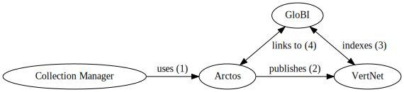
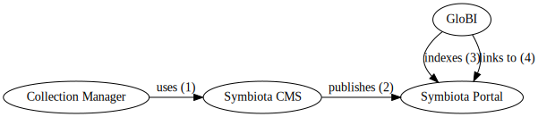
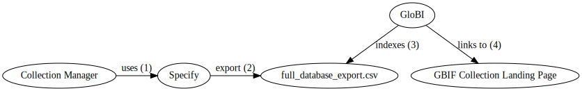
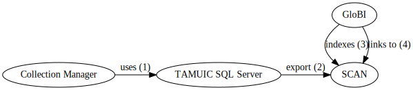

<a class="logos" href="https://parasitetracker.org/"></a>

This [Terrestrial Parasite Tracker](https://parasitetracker.org) (TPT) status page shows the current state of integration between TPT affiliated collections and GloBI.

[edit this page](https://github.com/globalbioticinteractions/globalbioticinteractions.github.io/blob/main/parasitetracker/index.md) / [edit collection list](https://github.com/globalbioticinteractions/globalbioticinteractions.github.io/blob/main/_data/parasitetracker.tsv) / [ask a question](https://github.com/ParasiteTracker/data-issues-observations-and-questions/issues) / [contribute data](https://github.com/globalbioticinteractions/globalbioticinteractions/issues)

[events](#events)
/ [collections status](#tpt-collections-status)
/ [integration profiles](#integration-profiles) 
/ [DwC-A guidelines](#dwca-guidelines) 
/ [translation tables](#translation-tables) 
/ [supported biotic interaction terms](#supported-terms) 


# Events 

**1 Oct 2019** -  Parasite Tracker kick-off [presentation](./assets/globi_adbc_summit_20191001.pdf) / [video](https://vimeo.com/362883545). 

**24 Feb 2020** -  Publication of ```Poelen, Jorrit H., Seltmann, Katja &, Campbell, Mariel & Orlofske, Sarah A.. (2020). Terrestrial Parasite Tracker indexed biotic interactions and review summary (Version 0.1) [Data set]. Zenodo. http://doi.org/10.5281/zenodo.3685365``` .  For summaries see [indexed_interactions_by_collection.tsv](https://zenodo.org/record/3685365/files/indexed_interactions_by_collection.tsv) and [review_summary_by_collection.tsv](https://zenodo.org/record/3685365/files/review_summary_by_collection.tsv). For full report with review comments, indexed interactions and source datasets, please visit the Zenodo data publication at [http://doi.org/10.5281/zenodo.3685365](http://doi.org/10.5281/zenodo.3685365). 

**5 Mar 2020** - workshop GloBI presentation available via [doi:10.17605/OSF.IO/VK8WQ](https://doi.org/10.17605/OSF.IO/VK8WQ), workshop blog post at [Tracking Parasites](/2020/03/05/tracking-parasites/) 

**30 April 2020** -  Publication of ```Poelen, Jorrit H., Seltmann, Katja C., Campbell, Mariel & Orlofske, Sarah A.. (2020). Terrestrial Parasite Tracker indexed biotic interactions and review summary (Version 0.2) [Data set]. Zenodo. http://doi.org/10.5281/zenodo.3778773``` .  For summaries see [indexed_interactions_by_collection.tsv](https://zenodo.org/record/3778773/files/indexed_interactions_by_collection.tsv) and [review_summary_by_collection.tsv](https://zenodo.org/record/3778773/files/review_summary_by_collection.tsv). For full report with review comments, indexed interactions and source datasets, please visit the Zenodo data publication at [http://doi.org/10.5281/zenodo.3778773](http://doi.org/10.5281/zenodo.3778773). 

**1 May 2020** - Publication of ```Kathryn Sullivan, Katja Seltmann, Jorrit Poelen, & Jennifer M. Zaspel. (2020, May). Making Parasite-Host Associations Visible in Terrestrial Parasite Tracker (TPT) (Version 0.0.1). Zenodo. http://doi.org/10.5281/zenodo.3780543```. The [publication](http://doi.org/10.5281/zenodo.3780543) (see [doi:10.5281/zenodo.3780543](http://doi.org/10.5281/zenodo.3780543)) contains transcription guidelines to help capture biotic assocations in natural history collections.   

**8 July 2020** - Webinar: Making parasite-host associations visible in Terrestrial Parasite Tracker (TPT) [mp4 video](https://drive.google.com/file/d/1Z5He729SGj8IW-tHI9o1_GmOvQCdOYaU/view) / [slides](http://doi.org/10.5281/zenodo.3941952) / [iDigBio wiki](https://www.idigbio.org/wiki/index.php/Terrestrial_Parasite_Tracker_Workshop:_Best_Practices_and_Standardization_of_Digital_Data_Capture#Webinar_Follow-up). The slides have been published via on update of: ```Kathryn Sullivan, Katja Seltmann, Jorrit Poelen, & Jennifer M. Zaspel. (2020, May). Making Parasite-Host Associations Visible in Terrestrial Parasite Tracker (TPT) (Version 0.0.1). Zenodo. http://doi.org/10.5281/zenodo.3941952``` . 

**19 Oct 2020** - Katja Seltmann presented at [TDWG 2020 Conference](https://www.tdwg.org/conferences/2020): Seltmann KC, Poelen JH, Sullivan K, Zaspel J (2020) Making Parasite-Host Associations Visible using Global Biotic Interactions. Biodiversity Information Science and Standards 4: e58985. [https://doi.org/10.3897/biss.4.58985](https://doi.org/10.3897/biss.4.58985) slides: [https://docs.google.com/presentation/d/1qJTIiR77_2RmO5OErGr1FGwPWp2PvJ33wVhOoL3tD1Y](https://docs.google.com/presentation/d/1qJTIiR77_2RmO5OErGr1FGwPWp2PvJ33wVhOoL3tD1Y).

**31 Mar 2021** - iDigBio hosted Terrestrial Parasite Tracker TCN webinar with updates from the TPT Research Advisory Board and other collaborators. [abstract](https://www.idigbio.org/content/terrestrial-parasite-tracker-data-and-collections-based-research) [video](https://vimeo.com/531437207) [slides](tpt-webinar-data-for-research-2021-03-31.pdf)

**28 April 2021** - Terrestrial Parasite Tracker GloBI workshop: Seltmann KC & Poelen JH. 2021. A Practical Exploration of Biotic Interaction Data Management and Information Retrieval through Terrestrial Parasite Tracker (TPT) and Global Biotic Interactions (GloBI) [Workshop]. Zenodo. [doi:10.5281/zenodo.4759060](https://doi.org/10.5281/zenodo.4759060). See also [video](https://vimeo.com/546669878) and reusable/hackable workshop repository at [https://github.com/globalbioticinteractions/interaction-data-workshop](https://github.com/globalbioticinteractions/interaction-data-workshop). See also [https://www.globalbioticinteractions.org/interaction-data-workshop/](https://www.globalbioticinteractions.org/interaction-data-workshop/).

**8 June 2021** - Presented at the [5th Annual Digital Data in Biodiversity Research Conference](https://www.idigbio.org/wiki/index.php/5th_Annual_Digital_Data_Conference,_Florida_Museum_of_Natural_History) on 8 June 2021 hosted online by the Florida Museum of Natural History: Seltmann, Katja. (2021, June). 🐝 interacts with 🌼 (Version 0.1). Zenodo. http://doi.org/10.5281/zenodo.4924889 . [abstract](http://doi.org/10.5281/zenodo.4924889) [video](https://vimeo.com/564804784) [slides](https://zenodo.org/record/4924889/files/seltmann-bee-interacts-with-flower-2021-06-08.pdf) [tweet](https://twitter.com/GlobalBiotic/status/1406001107130740738)

**24 June 2021** - Publication of: Poelen, Jorrit H., Seltmann, Katja C., Campbell, Mariel & Orlofske, Sarah A.. (2021). Terrestrial Parasite Tracker indexed biotic interactions and review summary (Version 0.4) [Data set]. Zenodo. [https://doi.org/10.5281/zenodo.5029617](https://doi.org/10.5281/zenodo.5029617) .


**20 Sept 2021** - Poster publication of: Sullivan, Kathryn, Poelen, Jorrit H., Seltmann, Katja C., & Zaspel, Jennifer M. (2021). Making Parasite-Host Associations Visible using Global Biotic Interactions (Version 1). Zenodo. [https://doi.org/10.5281/zenodo.5518108](https://doi.org/10.5281/zenodo.5518108) [abstract](https://zenodo.org/record/5518108/files/Sullivan_etal_GloBI_TPT_Abstract_20210922.pdf) [poster](https://zenodo.org/record/5518108/files/Sullivan_etal_GloBI_TPT_Poster_2021092.pdf) [audio](https://zenodo.org/record/5518108/files/Sullivan_etal_GloBI_TPT_Audio_20210922.mp3) [audio transcript](https://zenodo.org/record/5518108/files/Sullivan_etal_GloBI_TPT_Audio_Transcript_20210922.pdf) [tweet](https://twitter.com/GlobalBiotic/status/1440085932707876866).

**4 Oct 2021** - Tweet: ```"G. oregonensis's cousin, the Mexican Flying Squirrel (Glaucomys volans), host squirrel fleas (Orchopeas fulleri) according to https://collections-zoology.fieldmuseum.org/catalogue/4355428 by Robin Delapena of @FieldMuseum through @NSF https://parasitetracker.org . @KayceCBell are there *gliding* squirrel fleas too?"``` [tweet](https://twitter.com/GlobalBiotic/status/1445088137357660164). 

**15 Oct 2021** - Publication of: Poelen, Jorrit H., Seltmann, Katja C., Campbell, Mariel & Orlofske, Sarah A.. (2021). Terrestrial Parasite Tracker indexed biotic interactions and review summary (Version 0.5) [Data set]. Zenodo. [https://doi.org/10.5281/zenodo.5572874](https://doi.org/10.5281/zenodo.5572874) .

**22 June 2022** - Erika Tucker of TPT led a workshop on interpreting biotic associations as part of the Entomology Collections Workshop (ECM) 2022. Tucker, Erika, Poelen, Jorrit, & Seltmann, Katja. (2022, June 23). globalbioticinteractions/ecm-workshop:. Zenodo. [https://doi.org/10.5281/zenodo.6704580](https://doi.org/10.5281/zenodo.6704580). Also see [https://globalbioticinteractions.org/ecm-workshop](https://globalbioticinteractions.org/ecm-workshop).  

**22 June 2022** - Jorrit Poelen presented "On Interpreting Biotic Association Records" as part of the Entomology Collections Workshop (ECM) 2022: Poelen, Jorrit H. (2022, June 22). On Interpreting Biotic Association Records. Zenodo. [https://doi.org/10.5281/zenodo.6686306](https://doi.org/10.5281/zenodo.6686306) .

**27 June 2022** - Publication of: Poelen, Jorrit H., Seltmann, Katja C., Campbell, Mariel, Orlofske, Sarah A., Light, Jessica E., Tucker, Erika M., Demboski, John R, McElrath, Tommy, Grinter, Christopher C, Diaz-Bastin, Rachel, Bush, Sarah E, Delapena, Robin, Cook, Joseph, Gall, Lawrence F., Whiting, Michael F, Clark, Shawn M, Cameron, Stephen L, Replogle, Charla R, Rund, Samuel S.C., … Allen, Julie. (2022). Terrestrial Parasite Tracker indexed biotic interactions and review summary (0.6) [Data set]. Zenodo. <a href="https://doi.org/10.5281/zenodo.6761707">https://doi.org/10.5281/zenodo.6761707</a> .

**13 October 2022** - Publication of: Poelen, Jorrit H., Seltmann, Katja C., Campbell, Mariel, Orlofske, Sarah A., Light, Jessica E., Tucker, Erika M., Demboski, John R, McElrath, Tommy, Grinter, Christopher C, Diaz-Bastin, Rachel, Bush, Sarah E, Delapena, Robin, Cook, Joseph, Gall, Lawrence F., Whiting, Michael F, Clark, Shawn M, Cameron, Stephen L, Replogle, Charla R, Rund, Samuel S.C., … Bailey, Colin. (2022). Terrestrial Parasite Tracker indexed biotic interactions and review summary (0.7) [Data set]. Zenodo. [https://doi.org/10.5281/zenodo.7194486](https://doi.org/10.5281/zenodo.7194486)

**13 October 2022** - Foundational Taxonomic Resources For The Terrestrial Parasite Tracker (TPT) Project included in: Poelen, Jorrit H. (2022). Nomer Corpus of Taxonomic Resources hash://sha256/b3742bf43d9da0a8ed5522659199f47d68d31aaf46c90381190f324c1ac143f2 hash://md5/26a9b6c796567b3985e8bfe750ea2341 (0.7) [Data set]. Zenodo. [https://doi.org/10.5281/zenodo.7196029](https://doi.org/10.5281/zenodo.7196029) . For context, see [https://github.com/globalbioticinteractions/globalbioticinteractions/issues/694](https://github.com/globalbioticinteractions/globalbioticinteractions/issues/694) . 

**13 October 2022** - GloBI's Nomer [v0.3.2](https://github.com/globalbioticinteractions/nomer/releases/tag/0.3.2) now supports a first version to align names to the Foundational Taxonomic Resources For The Terrestrial Parasite Tracker (TPT) Project .


# TPT Collections Status

Click on badges to browse/download indexed records or inspect automated reviews.

[edit collection list](https://github.com/globalbioticinteractions/globalbioticinteractions.github.io/blob/main/_data/parasitetracker.tsv)





[]({{ globi-url }}) <a href="#{{ c.institution_code }}">{{ c.institution_code }}</a> {{ " / " }}


|status|institution/collection|platform|contact|
|---|---|---|---|---


 




















[]({{ review-url }}) []({{ globi-url }}) []({{ config-url }}) []({{ issues-url }}) []({{ names-url }}) | <span id="{{ c.institution_code }}">{{ c.institution_code }}</span> / {{ c.institution }} {{ c.collection_code }} / {{ c.collection }} | [{{ c.platform }}](#{{ c.platform | downcase }}) | {{ c.contact }} | 


# Integration Profiles
Integration profiles are descriptions on how data flows from one system to the next. Because the Parasite Tracker community is using a variety of tools (e.g., Arctos, Symbiota, Specify, Excel, MSAccess) to manage and share collection data, there are many integration profiles to exchange collection data. The integration profiles below are geared towards the exchange and linking of biotic associations data (e.g., species interactions, or host-parasite associations) with [GloBI](https://globalbioticinteractions.org). 

## Arctos
Arctos managed collections are indexed by GloBI. This section explains how.

 Arctos | GloBI Integration Profile 
 --- | --- 
 authors | Dusty (Arctos dev), Mariel Campbell (MSB), Teresa Mayfield-Meyer (MSB)
 actors | Arctos, VertNet, GloBI
 integration method | A collection manager uses Arctos to establish associations or relationships between records. Arctos periodically shares data with VertNet. VertNet uses [GBIF IPT](https://www.gbif.org/ipt) software to publish data archives. VertNet publishes a list of available datasets in the form of a RSS feed, including those shared by Arctos. Periodically, GloBI finds, and downloads, Arctos related data archives in VertNet. Then, GloBI indexes the associatedOccurrences fields of records in these Arctos data archives. The associatedOccurrences contain the association type (e.g., "eats") and a pointer to the occurrence id of the linked record.
  diagram | 
example collection | [MSB-PARA](#MSB-PARA)

## Symbiota
## SymbSCAN
Various Symbiota-based collections are indexed by GloBI. This section explains how.


 Symbiota | GloBI Integration Profile
 --- | ---
 authors | Katja Seltmann (UCSB)
 actors | Collection Manager, Symbiota CMS<sup>1</sup>, Symbiota Portal<sup>1</sup>, GloBI
 integration method | A collection manager uses the "associatedTaxa" fields in Symbiota CMS to record host-parasite associations. The Symbiota CMS periodically publishes their data to a Symbiota Portal (e.g., https://scan-bugs.org , ) . After successful publication, the Symbiota Portal includes the updates data archive in their list of available datasets through their RSS feed. GloBI indexes all data archives in the list of available datasets. For each dataset, GloBI looks for association records in associatedTaxa, associatedOccurrences, dynamicProperties field as well as Resource Relationship and Associated Taxa Extensions. In this case, only associatedTaxa fields are encountered and related records are indexed accordingly.
  diagram | 
 example collection | [UCSB-IZC](#UCSB-IZC)

<sup>1</sup>Note that Symbiota includes two distinct systems: Symbiota CMS and Symbiota Portal. Symbiota CMS is a collection management system typically used to keep a digital inventory of physical collections. Symbiota Portal exposes digital records as Darwin Core Archives and Ecological Metadata Language files, These Darwin Core Archives and EML files are included in a list of available datasets in the form of a RSS feed. So, This include records retrieved from Symbiota CMS as well as other systems or datasources (e.g., spreadsheets, csv files). Symbiota Portal is used to help interface with national and global aggregators like iDigBio and GBIF. 

## Specify
Association records in Specify managed collections are indexed by GloBI. This section explains how.

 Specify | GloBI Integration Profile
 --- | ---
 authors | Ralph Holzenthal (UMSP), Robin Thomson (UMSP) 
 actors | Collection Manager, Excel, Specify6, https://scan-bugs.org 
 integration method | Collection Manager enters records in excel, then uploads the records in batch into Specify. A manual export to https://scan-bugs.org is done periodically to provide updates to GBIF, iDigBio and GloBI. If updates are made to existing Specify records, a new batch export is needed to update https://scan-bugs.org .  
  diagram | 
example collection |
  open questions | 1. Which darwin core archive field to use for assocations? associatedTaxa, associatedOccurrences, Resource Relationship extension. 2. Can we automate the export of Specify records to SCAN? 
  references | Linking Specify data to SCAN Collection Provided by Laura Prado, U. of Wisconsin (December 8, 2018) https://scan-all-bugs.org/?page_id=2084

 Specify | GloBI Integration Profile
 --- | ---
 authors | Erika Tucker (UMMZ), Barry Oconner (UMMZ)
 actors | Collection Manager, Specify, https://gbif.org/ 
 integration method | Collection Manager enters records in Specify. A manual csv export of full Specify database (including host records) is shared with, and indexed by, GloBI. If updates are made to existing Specify records, a manual export performed and GloBI is notified.
  diagram | 
example collection |
  open questions | 1. Which darwin core archive field to use for assocations? associatedTaxa, associatedOccurrences, Resource Relationship extension. 2. How to establish an automated the export of Specify records via (UMich) IPT? 3. How to best link to individual specimen records? 4. How to best cite specimen records? 5. How to establish reliable links to non-UMMZI host records?
  references | [2020-01-23 Meeting notes](ummz-2020-01-23-notes) and [Jan 2020 email exchanges](ummz-email-thread-2020-01.eml) between Jorrit (GloBI), Erika (UMMZ), Barry (UMMZ)
  example collection |  [UMMZ](#UMMZ), [UMMZI on GloBI](https://globalbioticinteractions.org/?accordingTo=globi:globalbioticinteractions/ummzi) and [UMMZI on github](https://github.com/globalbioticinteractions/ummzi) .


## EMu
The EMu <> GloBI integration profiles describes a way GloBI indexes assocation data originating from EMu .  

EMu/GBIF | GloBI Integration Profile
 --- | ---
authors | Kate Webbink, Janeen Jones 
actors | FMNH Collection Manager, EMu, IPT, GloBI
integration method | A collection manager uses EMu to establish associations or relationships between Catalogue (occurrence) records. The collection manager periodically exports datasets from EMu, and the IT Department publishes those datasets as resources on the FMNH IPT - fmipt.fieldmuseum.org. Datasets ("IPT resources") that include interactions among occurrences will include a Darwin Core "Resource Relationship" extension. The fmipt site publishes a list of available IPT resources in the form of a RSS feed (https://fmipt.fieldmuseum.org/ipt/rss.do), similarly to VertNet. Periodically, GloBI could find and download FMNH-related data archives in the fmipt. Then, GloBI could index the resourceID fields of records in these FMNH data archives (IPT resources). The relationshipOfResource field contains the relationship type (e.g., “stomach contents of”) and the relatedResourceID field contains a pointer to the occurrenceID of the linked record.
diagram | A workflow using a public EMu website for GloBI to link back into:  An alternative workflow using a Symbiota Portal for public linking: 
example collection | https://fmipt.fieldmuseum.org/ipt/manage/resource?r=fmnh-rr-test ( https://github.com/jhpoelen/eol-globi-data/files/3586074/dwca-fmnh-rr-test-v1.1.zip ) Post-FMNH/EMu-data-standardization, more resources on fmipt will include a “Resource Relationship” DwC extension

## TAMUIC

TAMUIC | GloBI Integration Profile
 --- | ---
authors | John Oswald
actors | Collection Manager, SQL Server, SCAN, GloBI
integration method | A collection manager uses SQL Server to manage collection record relations. The collection manager episodically exports datasets from SQL Server to SCAN as a Darwin Core Archive. Periodically, GloBI indexes TAMUIC related datasets as part of indexing all of SCAN. 
diagram |  

## TaxonWorks

PSUC | GloBI Integration Profile
 --- | ---
authors | Andrew R. Deans, Laura Porturas
actors | Curator, Data Manager, TaxonWorks, SCAN, GloBI
integration method | A curator uses TaxonWorks to manage collection object associations. The data manager periodically exports data from TaxonWorks to SCAN as Darwin Core Archive. Periodically, GloBI indexes PSUC datasets as part of indexing all of SCAN.
diagram | ?
example collection | ?

## Institutional
## Undecided

Your platform/project here | GloBI Integration Profile
 --- | ---
authors | ?
actors | ?
integration method | ?
diagram | ?
example collection | ?


Aside from various collection management systems, some collections use custom, home grown tools to manage their digital inventory. When feasible, we aim to develop custom integration profiles for those institutional solutions, provided that the data is openly accessible on the internet. 


# DwCA Guidelines

Darwin Core Archives provide several ways to capture biotic associations including: [associatedTaxa](https://dwc.tdwg.org/terms/#associatedTaxa), [associatedOccurrences](https://dwc.tdwg.org/terms/#associatedOccurrences), [ResourceRelationship](https://dwc.tdwg.org/terms/#resourcerelationship), and [dynamicProperties](https://dwc.tdwg.org/terms/#dwc:dynamicProperties). 

For specific examples also see GloBI blog posts [Associating with Natural History Collections](/2019/07/10/associating-with-natural-history-collections/) and [Models in Fashion](/2018/08/16/models-in-fashion/#darwin-core-archives).

## General Guidelines
The interaction information should be shared in multiple ways through DwC-A because no single way is sufficient for all aggregators. GBIf does display Dynamic Properties and Associated Taxa (according to K. Seltmann).

## Associated Taxa
http://rs.tdwg.org/dwc/terms/associatedTaxa should always be filled out when an association is present (according to K. Seltmann).

## Associated Occurrences
If http://rs.tdwg.org/dwc/terms/associatedOccurrences are listed, those should be a separate column in the DwC-A (not included in http://rs.tdwg.org/dwc/terms/dynamicProperties) (according to K. Seltmann).

http://rs.tdwg.org/dwc/terms/associatedOrganisms may include a relationship and link.

## Dynamic Properties
http://rs.tdwg.org/dwc/terms/dynamicProperties should be used to handle all other information about an interaction formatted in JSON (according to K. Seltmann). 

## Resource Relations
https://dwc.tdwg.org/terms/#resourcerelationship is another way of adding biotic interactions to the Darwin Core archive, but only accommodates key:values, thus dynamicProperties will also be needed for more complex information (according to K. Seltmann).

https://dwc.tdwg.org/terms/#resourcerelationship is designed to link, or relate, occurrence/taxon or any kind of DwC record using a defined relationship. This means that many details from the linked records are inherited (e.g., lifestage of a specimen described by a linked occurrence record). However, limited information (e.g., https://dwc.tdwg.org/terms/#dwc:relationshipAccordingTo, https://dwc.tdwg.org/terms/#dwc:relationshipEstablishedDate, https://dwc.tdwg.org/terms/#dwc:relationshipRemarks) can be associated to the relationship record itself (according to J.H. Poelen).

(work in progress) Include best practices, pros/cons, examples and links to datasets using the extensions. 

# Interaction Types 
# Supported Terms
# Translation Tables

GloBI uses a subset of biotic interaction (or association) terms defined in the [OBO Relations Ontology](http://www.obofoundry.org/ontology/ro.html) (OBO RO) to help classify and index biotic associations in collection records. Verbatim association types (e.g., ```on```, ```parasite of```, ```found on```) are explicitly mapped into these OBO RO terms using translation tables. GloBI keeps a default translation tables and specific collection may choose to provide their own (see e.g., [INHS-Insects](https://github.com/globalbioticinteractions/inhs-insects) ).

| resource | description |
| --- | --- |
| [OBO Relations Ontology project page](http://obofoundry.org/ontology/ro.html) | OBO RO contains many kinds of terms, not just biotic associations terms |
| [List of OBO RO Biotic Interaction Terms with definitions](https://github.com/globalbioticinteractions/nomer/blob/main/nomer/src/test/resources/org/globalbioticinteractions/nomer/match/ro.tsv) | a table of RO biotic interaction terms and their definitions (if available)
| [List of GloBI Supported Interaction Terms](https://github.com/globalbioticinteractions/globalbioticinteractions/blob/main/eol-globi-lib/src/main/resources/org/globalbioticinteractions/interaction_types_ro.csv) | subset of RO interactions terms that GloBI uses for indexing |
| [Default Verbatim Terms Translation Table](https://github.com/globalbioticinteractions/globalbioticinteractions/blob/main/eol-globi-lib/src/main/resources/org/globalbioticinteractions/interaction_types_mapping.csv) | the translation table used by GloBI to maps verbatim interaction terms to supported interaction terms
| [Example of Custom Verbatim Terms Translation Table](https://github.com/globalbioticinteractions/inhs-insects/blob/main/interaction_types_mapping.csv) | if provided/needed, GloBI can use a custom mapping provided by a collection |

The OBO RO is far from complete and we expect to add new terms and improve definitions as needed. Also, GloBI translation tables can be easily updated when needed. Please [open an issue](https://github.com/globalbioticinteractions/globalbioticinteractions/issues/new) if you have questions or suggestions. 
